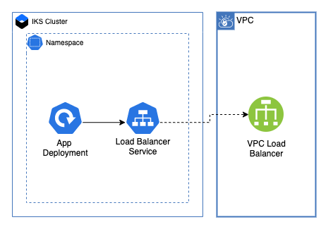

# Microservices with load balancer on Kubernetes cluster

These modules deploy a simple demo app to an IKS Cluster using a [Load Balancer](./load_balancer) deployment.

## Load Balancer Deployment



## Table of Contents

1. [Setup](##setup)
2. [Deployment](##deployment)
3. [Load Balancer Depolyment Pattern](##Load-Balancer-Depolyment-Pattern)
4. [Module Variables](##Module-Variables)

---

## Setup

Ensure that the account you're using to create this deployment has permissions to create Load Balancer for VPC. When you create a load balancer service, a VPC load balancer is automatically created

### Creating the Image In IBM Cloud Container Registry

In order to make sure this architecture deploys correctly, ensure that you have copied any icr image pull secrets into the namespace where the app will be deployed if you're using ICR for the images. You will need to have Docker installed locally. You can find more information on getting started with IBM Container Registry [here](https://cloud.ibm.com/docs/Registry).

Both of these deployment patterns use a [node demo app](./node-demo-app). To upload this example application to [IBM Cloud Container Registry](https://www.ibm.com/cloud/container-registry) follow these steps:

1. Log in to IBM Cloud using the CLI

```
ibmcloud login
```

2. Log in to the IBM Container Registry

```
ibmcloud cr login
```

3. If you do not have a namespace you want to use with your app, create a namespace:

```
ibmcloud cr namespace-add <my_namespace>
```

4. In the `./node-demo-app` directory run this command to build the docker container:

```
docker build . -t <image_name>:<tag>
```

5. Next, tag the image to upload to ICR

```
docker tag <image_name>:<tag> <region>.icr.io/<my_namespace>/<new_image_repo>:<new_tag>
```

6. Push the image to ICR

```
docker push <region>.icr.io/<my_namespace>/<new_image_repo>:<new_tag>
```

---

## Deployment

This pattern creates an IKS deployment equivalant to this .yaml file:

```
apiVersion: apps/v1
kind: Deployment
metadata:
  name: demo-app
  namespace: default
  labels:
    app: demo-app
spec:
  selector:
    matchLabels:
      app: test-app
  template:
    metadata:
      labels:
        app: api-service
    spec:
      containers:
      - image: <region>.icr.io/<my_namespace>/<new_image_repo>:<new_tag>
        name: test-app
        env:
            - name: PORT
              value: 8080
```

---

## Load Balancer Depolyment Pattern

Once the application has been deploued, the script creates a Load Balancer service. This service will create a Load Balancer for VPC where the application can be accessed. Please note that the application will not be available until the Load Balancer has finished creating. To access the application, you will need add the `app_port` to your Load Balancer URL:

```
<your_lb_host_name>:<app_port>
```

---

## Module Variables

The following variables are used for both deployment methods.

Variable           | Type   | Description                                                           | Default
-------------------|--------|-----------------------------------------------------------------------|--------
`ibmcloud_api_key` | String | The IBM Cloud platform API key needed to deploy IAM enabled resources |
`generation`       | String | Generation of VPC. Can be 1 or 2                                      | `2`
`ibm_region`       | String | IBM region for IKS on VPC cluster                                     | `us-south`
`group`            | String | Name of resource group to provision resources                         | `asset-development`
`app_name`         | String | Name for app in kubernetes                                            | `demo-app`
`namespace`        | String | Namespace to deploy application                                       | `default`
`container_name`   | String | Name for container in deployment                                      | `api-service`
`app_image`        | String | link to app image to install                                          | 
`app_port`         | String | Port for app to run                                                   | `8080`
`protocol`         | String | Service protocol                                                      | `TCP`
`service_port`     | String | Port for application                                                  | `8080`
`cluster_name`     | String | name of IKS cluster                                                   |
`lb_type`          | String | IKS on VPC load balancer type. Can be public or private               | `public`
